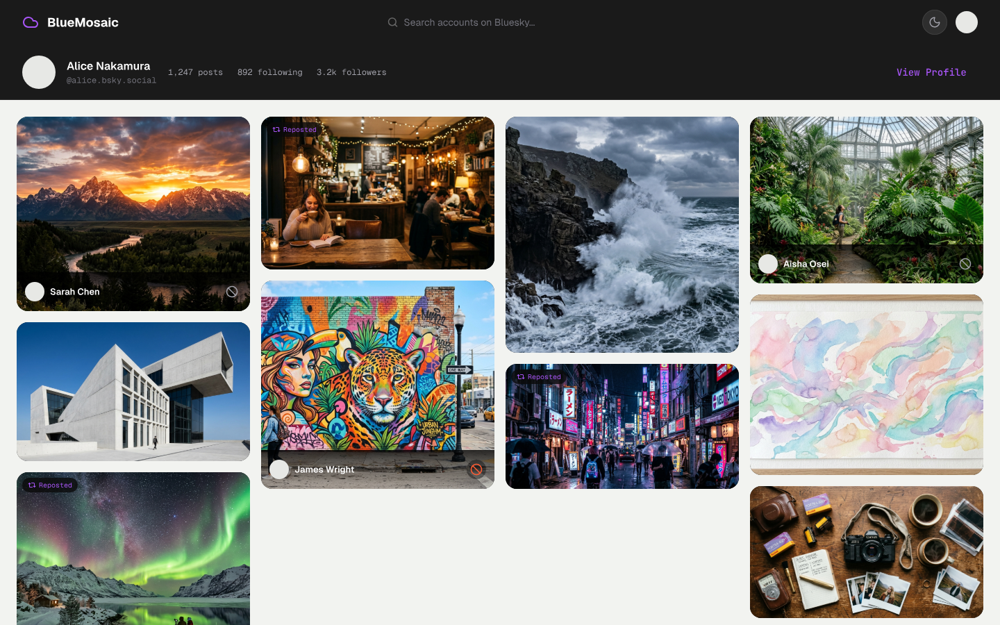
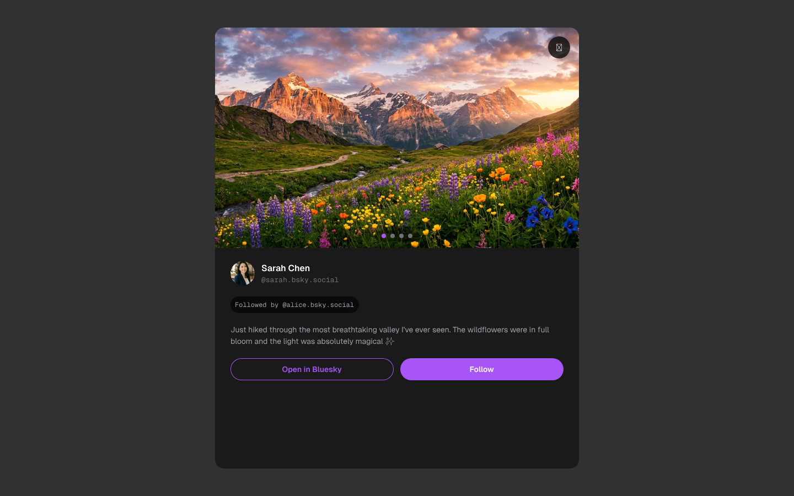
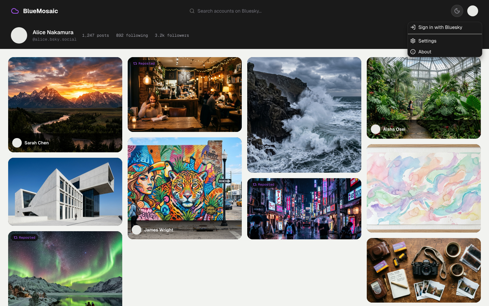
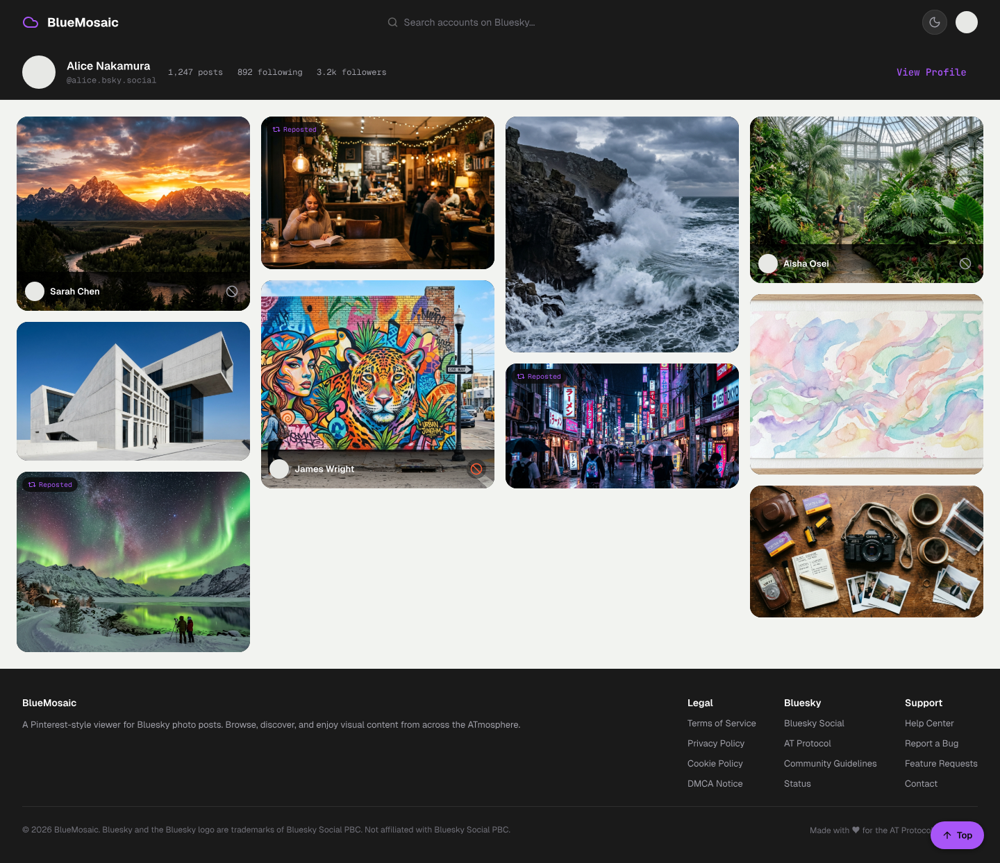

# BlueMosaic

A Pinterest-style photo mosaic viewer for the [Bluesky](https://bsky.social) social network. Browse visual content, discover new accounts through repost chains, and explore the ATmosphere.



## Features

- **Photo Mosaic** — Enter any Bluesky handle and see their photo posts in a masonry grid
- **Repost Crawling** — Discover new accounts by following repost chains up to 5 levels deep
- **Discovery Path** — See how each account was discovered through a visual node chain
- **Follow/Unfollow** — Sign in with your Bluesky account to follow accounts you discover
- **Not Interested** — Hide photos from specific accounts during a session
- **Dark/Light Theme** — Toggle between themes, persisted in localStorage
- **Fully Client-Side** — All API requests go directly from your browser to the Bluesky public API

### Screenshots

| Photo Modal | Avatar Menu |
|:-----------:|:-----------:|
|  |  |



## Getting Started

### Prerequisites

- Node.js 20+ (see `.nvmrc`)

### Development

```sh
npm install
npm run dev
```

Open [http://localhost:5173](http://localhost:5173).

### Docker

```sh
docker compose up
```

### Production Build

```sh
npm run build
npm run preview
```

## Authentication

BlueMosaic supports optional sign-in via [Bluesky App Passwords](https://bsky.app/settings/app-passwords). Your credentials are stored locally in your browser's localStorage and are never sent to any server. Signing in enables:

- Following/unfollowing accounts
- Higher API rate limits (per-account rather than per-IP)

## Architecture

```
src/
├── lib/
│   ├── api/
│   │   ├── bluesky.ts          # AT Protocol API wrapper
│   │   └── crawler.ts          # Repost chain crawl (runs in browser)
│   ├── components/
│   │   ├── DepthControl.svelte # Crawl settings (depth, accounts, posts)
│   │   ├── DiscoveryPath.svelte# Visual repost chain diagram
│   │   ├── Footer.svelte       # Site footer with legal links
│   │   ├── Mosaic.svelte       # Masonry photo grid
│   │   ├── PhotoCard.svelte    # Individual photo tile with hover overlay
│   │   ├── PhotoModal.svelte   # Full-size image modal with author info
│   │   ├── ScrollToTop.svelte  # Back-to-top button
│   │   └── SearchBar.svelte    # Handle search input
│   └── stores/
│       ├── auth.ts             # Bluesky auth (login, session persistence)
│       ├── crawl.ts            # Crawl state
│       └── theme.ts            # Dark/light theme toggle
├── routes/
│   ├── +layout.svelte          # App shell, header, avatar menu, about modal
│   ├── +page.svelte            # Home page with search
│   ├── mosaic/[handle]/        # Mosaic view for a profile
│   ├── terms/                  # Terms of Service
│   ├── privacy/                # Privacy Policy
│   ├── cookies/                # Cookie Policy
│   └── dmca/                   # DMCA Notice
```

All API calls are made client-side — there is no backend proxy. The crawl runs entirely in the browser using the `@atproto/api` SDK.

## Tech Stack

- [SvelteKit](https://svelte.dev) with TypeScript
- [@atproto/api](https://www.npmjs.com/package/@atproto/api) for Bluesky API access
- [adapter-cloudflare](https://www.npmjs.com/package/@sveltejs/adapter-cloudflare) for Cloudflare Pages deployment
- Docker for containerized deployment

## Legal

BlueMosaic is an independent, open-source project. It is not affiliated with, endorsed by, or sponsored by Bluesky Social PBC. "Bluesky" and the Bluesky logo are trademarks of Bluesky Social PBC.

## License

MIT
